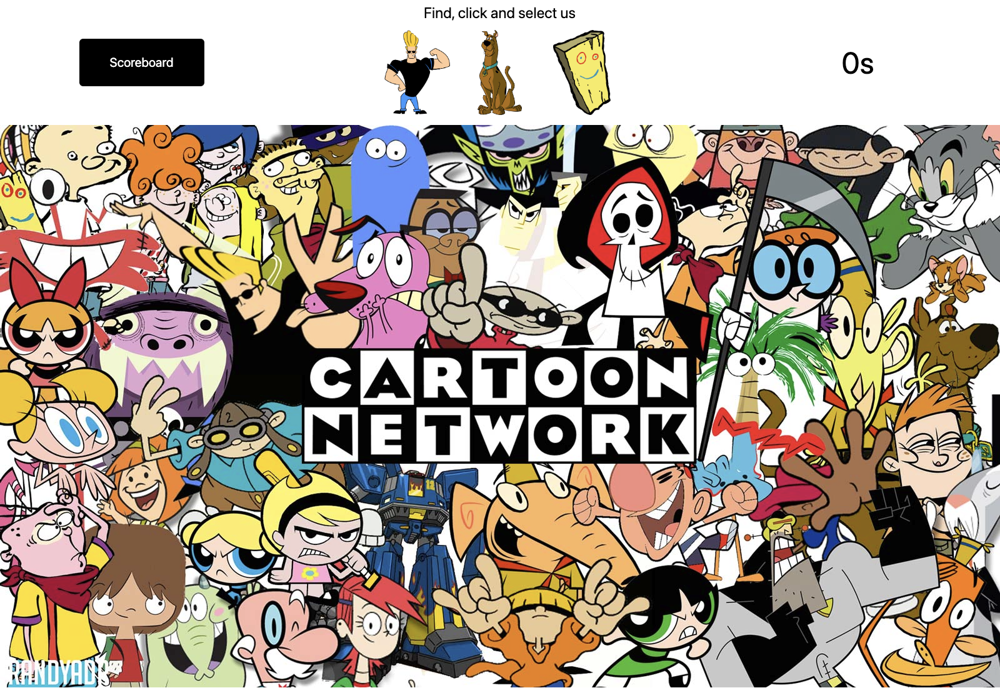

# "Where's Waldo?" A Photo Tagging React App

[View the project live by clicking here](https://patrikrasch.github.io/top-wheres-waldo/)

## A fully functional photo tagging app written in TypeScript using React and Tailwind

## Demo

## Purpose of the Project

Practice project to further skills in React, TypeScript and Tailwind.
Little deeper dive
What the project does?
What words are people searching for? Find what solves their problem

- Hello

## Game Features

Real-time character verification
Real-time game over verification
Secure game updates using Firebase cloud functions
Global leaderboard without login

## Technologies

TypeScript
React
Firestore
Tailwind CSS

5. User Instructions
   Instructions for people who aren't even coders
   Installation stuff

6. Developer Instructions

## Known issues

As this project is a practice project, efforts were primarily placed on ensuring the base functionality of the app.
Therefore, the end result is currently quite barebones and:

- Not mobile friendly
- Missing a more functional timer, currently only runs in pure seconds
- Works, but doesn't scale well on wide and ultrawide monitors
- Misses proper form validation for name input
- Has no censorship for names
- Overall design is lacking
